# JUnit 4
JUnit is a simple framework to write repeatable tests. It is an instance of the xUnit architecture for unit testing frameworks.

For more information, please visit:
* [Wiki](https://github.com/junit-team/junit4/wiki)
* [Download and Install guide](https://github.com/junit-team/junit4/wiki/Download-and-Install)
* [Getting Started](https://github.com/junit-team/junit4/wiki/Getting-started)

CodeMR Report
=================

You can download or clone the project to use the existing extracted model and graphs. 
You can create your graphs, your working sets and analyse the project based on the extracted model without limitation. 
You can download CodeMR plugins for your favorite IDE from:
- [CodeMR for IntelliJ](https://plugins.jetbrains.com/plugin/10811-codemr)
- [CodeMR for Eclipse](https://marketplace.eclipse.org/content/codemr-software-quality-tool) 

Access to the online report from  [CodeMR HTML Report](https://codemr.co.uk/case-reports/junit4/main_report/htmlx/lbd/dashboard.html) .

See CodeMR [web site](https://www.codemr.co.uk) for details on the CodeMR.

Download [trial license](https://www.codemr.co.uk/downloads) to try CodeMR for other projects.

CodeMR model path: ./codemr/junit/junit.mdl

### Snapshots ###

#### Overview #### 
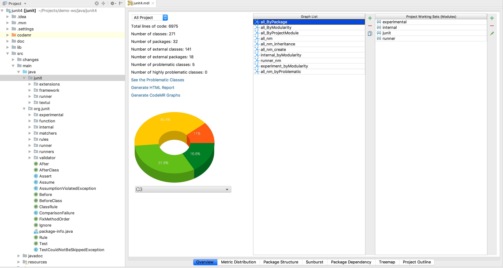

#### TreeMap Complexity View #### 
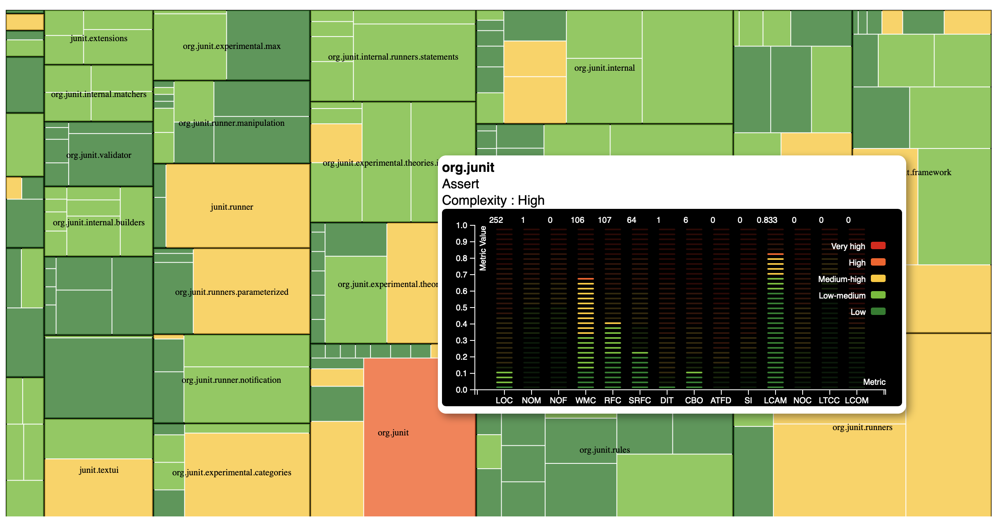

#### Package Structure Cohesion View #### 
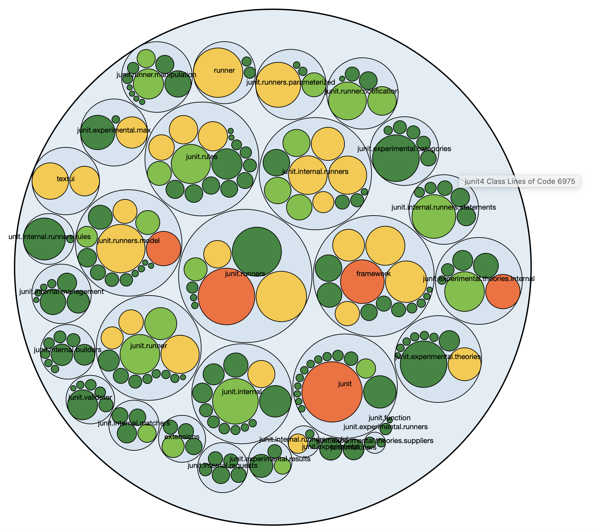

#### Package Dependency View #### 
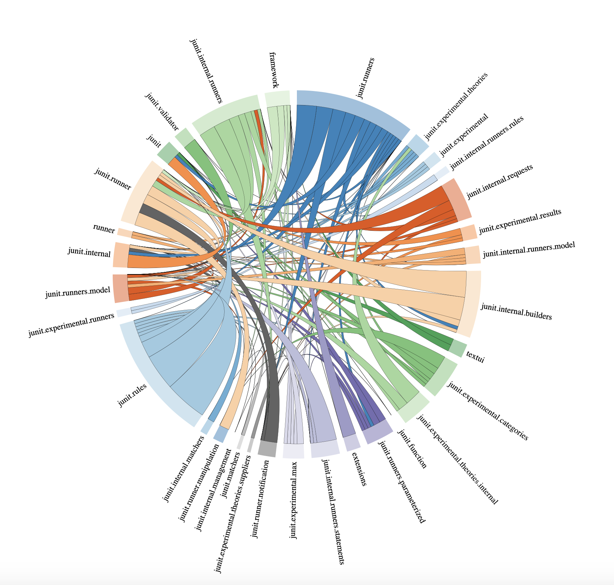

#### Outline View #### 
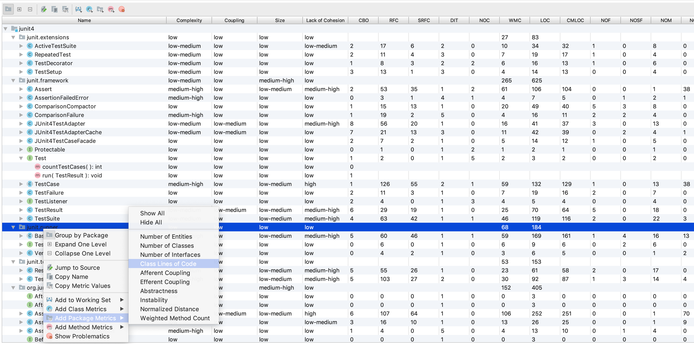

#### Modularity Graph #### 
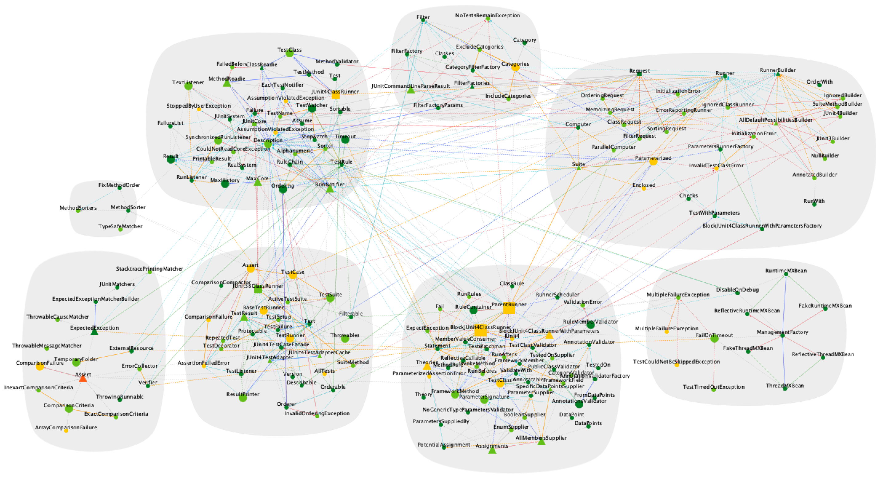

#### Create Relations #### 
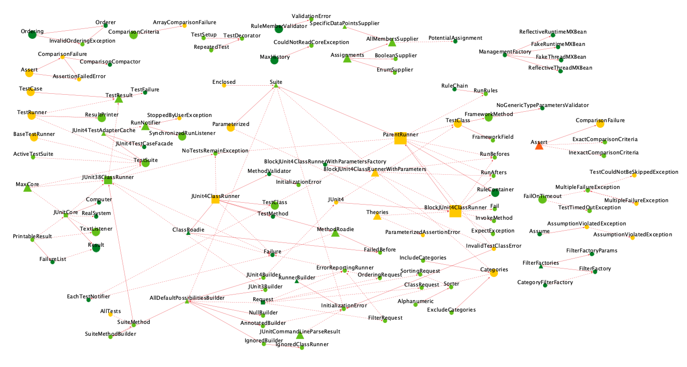

#### Experiment Package Modularity Graph #### 
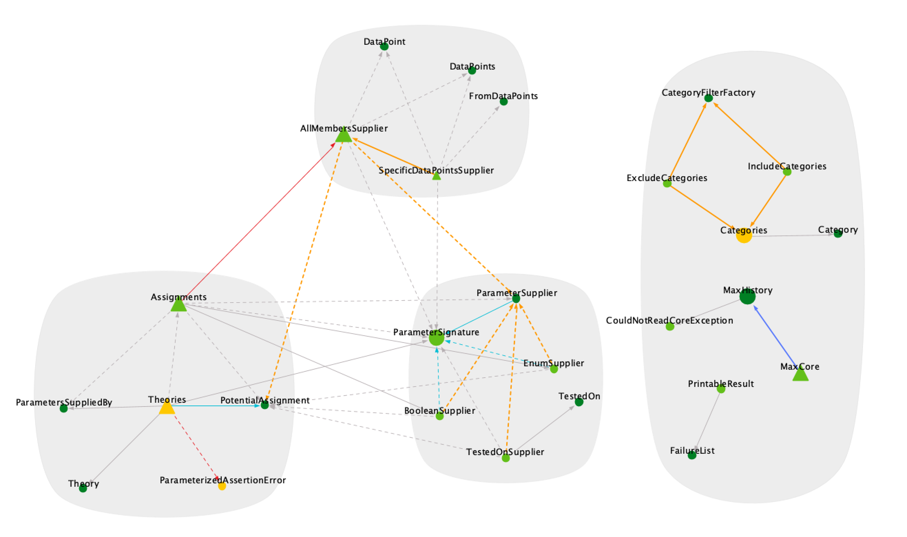

#### Internal Package Modularity Graph #### 
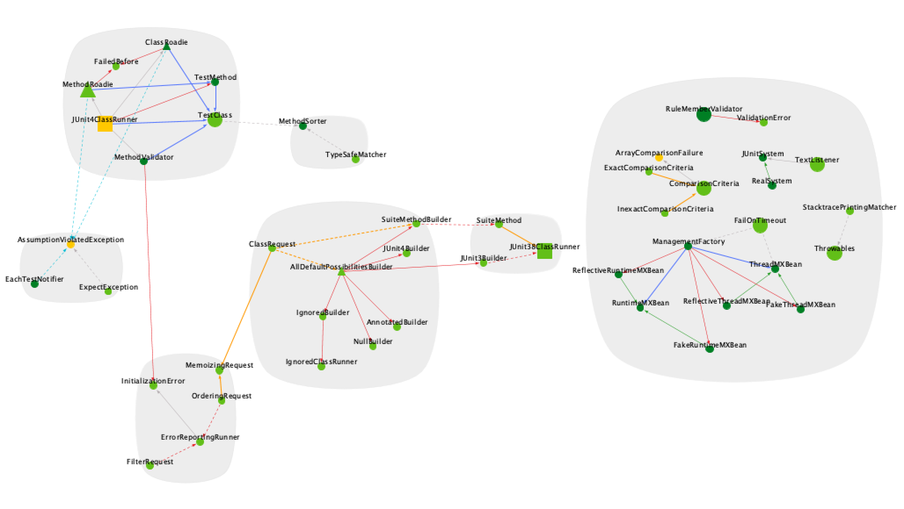

#### Implements and Inheritance Relations #### 
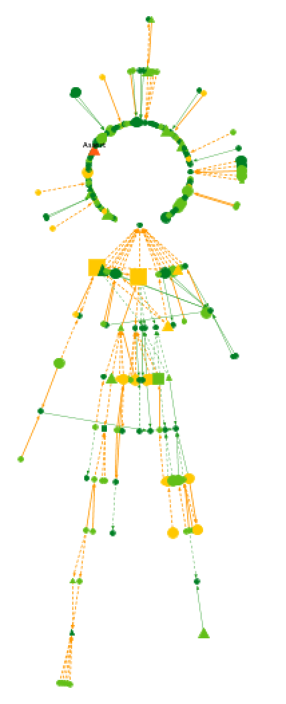

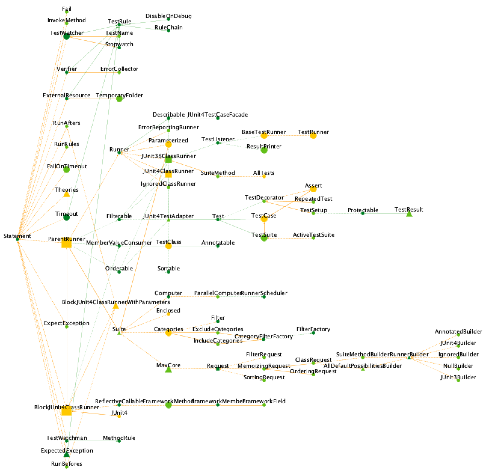
